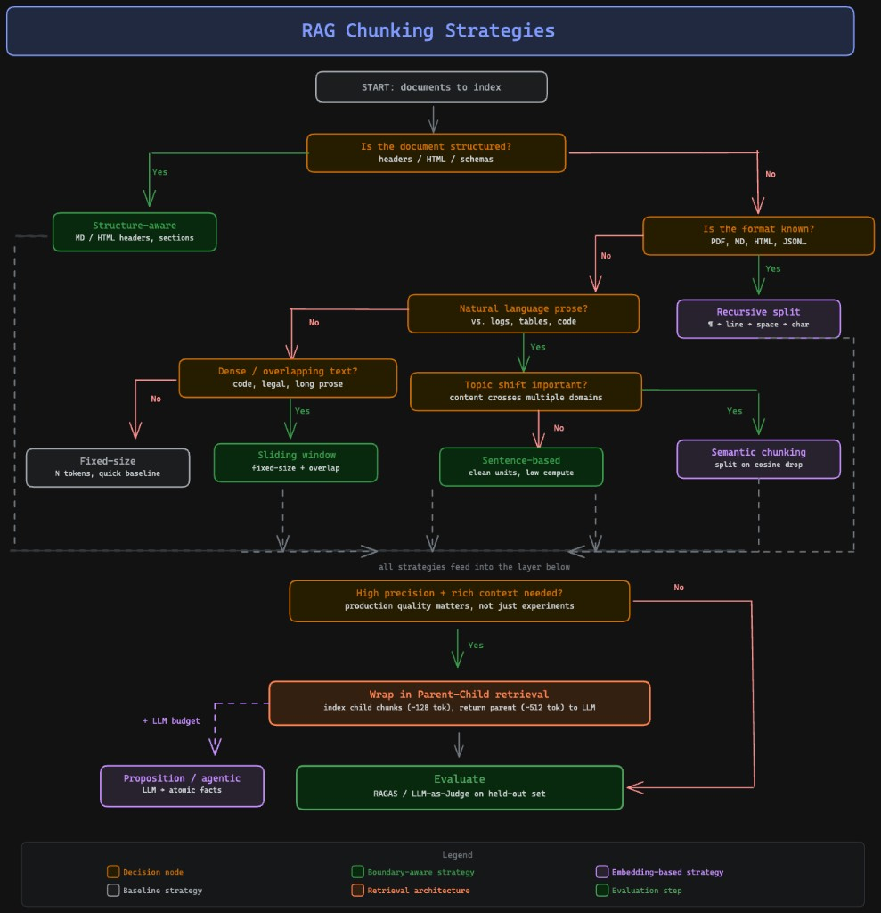

# Feature 1: Document Ingestion

Learn chunking by implementing and comparing 7 strategies on the same document.

## What this feature does

1. Load document  
2. Clean text  
3. Chunk with 7 strategies  
4. Compare chunk counts and boundaries

Run:

```bash
python3 -m pip install -r requirements.txt
python3 run.py
```

## Decision Tree (Which chunker to use?)




## 7 strategies in this feature

- **Fixed Size**: fastest baseline
- **Sentence Based**: clean sentence boundaries
- **Sliding Window**: overlap to reduce boundary loss
- **Recursive**: practical default for mixed text
- **Structure Aware (Markdown)**: best for sectioned docs
- **Semantic (Embedding-based)**: splits on topic shift
- **Parent-Document**: small retrieval + larger generation context
